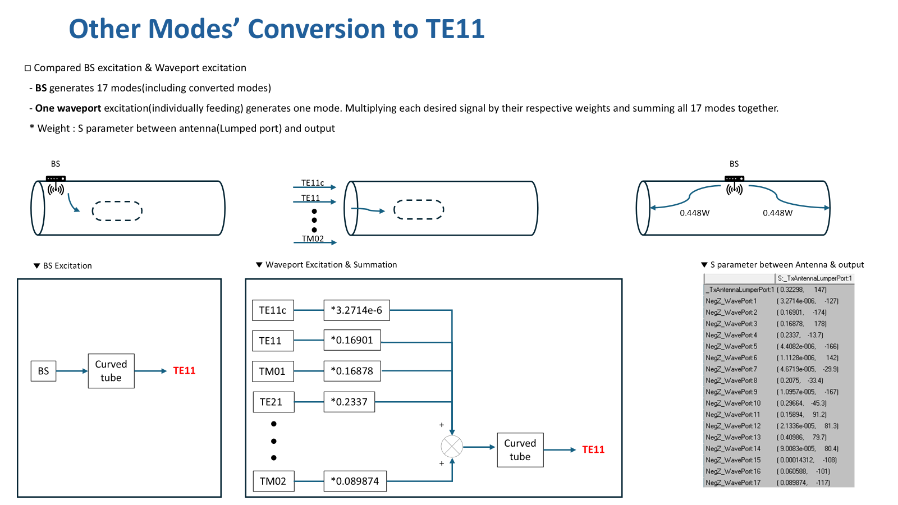

# S 파라미터

$$
S_{ab} = \frac{v_a^+}{v_b^-} 
$$

$$
\frac{{v_{lumped}}^+}{{v_{lumped}}^-} = 0.32298(mag)=-9.82dB
$$

한 포트에서 여러 포트로 전파 될때 

입력된 에너지의 총합은 각 포트로 반사되거나 전달된 에너지의 합과 같아야 한다 - 에너지 보존법칙

따라서 S파라미터 제곱의 합은 1이다.

e.g.) 포트가 4개일 때

$$
|S_{11}|^2+|S_{21}|^2+|S_{31}|^2+|S_{41}|^2=1
$$

나의 경우에는 

$$
|S_{Ant,Pos1}|^2+|S_{Ant,Pos2}|^2+|S_{Ant,Pos3}|^2+ \ldots  |S_{Ant,Neg1}|^2+ \ldots  |S_{Ant,Neg17}|^2=1
$$

ref: [http://www.ktword.co.kr/test/view/view.php?no=3418](http://www.ktword.co.kr/test/view/view.php?no=3418) - 무손실, 수동 2포트 회로망 

